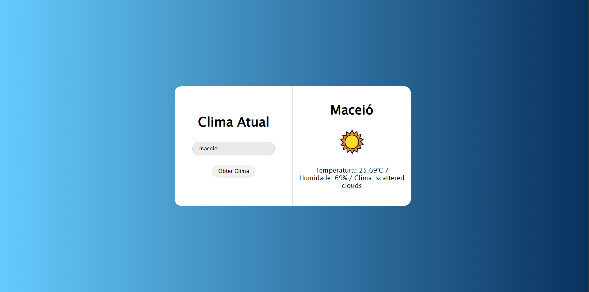

# WeatherWatch
Esta aplicação web permite a verificação das condições climáticas atuais. O projeto é um estudo focado em diversos conceitos e tecnologias, incluindo APIs, HTTP, requisições, promises, AJAX e Axios, entre outros. Desenvolvido exclusivamente para fins educativos, visa proporcionar uma compreensão prática e aplicada dessas ferramentas e técnicas.

## Clique aqui para visitar o projeto 👉🏻 <a href="https://victorbrasileiroo.github.io/WeatherWatch/">Demo</a>

